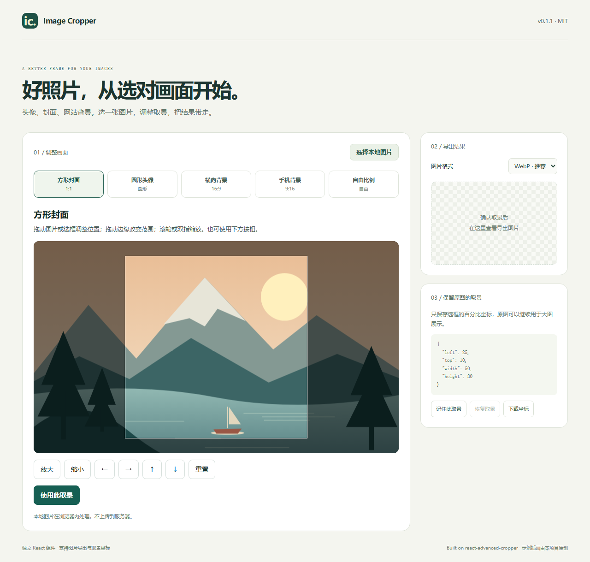

# Image Cropper

An independent React component for avatar, cover and website background cropping.

[中文](./README.md) · [API (Chinese)](./docs/API.md) · [MIT](./LICENSE)

Version 0.1.1 provides standalone source and an installable release tarball. It is **not published to npm yet**. It has no dependency on any existing website, backend or database.



## Run the demo

Node.js >=22.13.0 is required for development. Obtain this repository's source, then run:

```bash
git clone https://github.com/jack-114514/image-cropper.git
cd image-cropper
npm ci
npm run dev
```

The demo supports local uploads, square covers, circular avatars, landscape/portrait backgrounds, free ratios, real image downloads and saved crop coordinates. Local files are processed in the browser; the demo does not upload images. The included sample illustration is original project artwork.

## Install into a React website

Install the prebuilt GitHub Release package directly:

```bash
npm install https://github.com/jack-114514/image-cropper/releases/download/v0.1.1/image-cropper-0.1.1.tgz
```

Or build and install from source:

Build the package in this repository:

```bash
npm ci
npm run check
npm pack
```

Then install the resulting tarball in your website project:

```bash
npm install /path/to/image-cropper-0.1.1.tgz
```

React 18.2+ and React 19 are supported peers. Vue and plain HTML need a separate integration. The package is ESM and ships TypeScript declarations.

```tsx
'use client';
import { ImageCropper } from 'image-cropper';
import 'image-cropper/style.css';

// src can be a local URL.createObjectURL(file) or a CORS-enabled image URL.
<ImageCropper src={src} shape="circle" locale="en"
  output={{ maxSize: 1024, transparentCircle: true }}
  onConfirm={async ({ blob, mimeType, selection }) => {
    const extension = mimeType === 'image/jpeg' ? 'jpg' : mimeType.split('/')[1];
    const form = new FormData();
    form.append('image', blob, `avatar.${extension}`);
    form.append('selection', JSON.stringify(selection));
    const response = await fetch('/your-upload-endpoint', { method: 'POST', body: form });
    if (!response.ok) throw new Error('Upload failed');
  }}
  onError={(error) => console.error(error)} />
```

Revoke object URLs when their source file or preview is replaced or unmounted; see the complete lifecycle example in the Chinese README.

## Props and methods

| Prop | Default | Meaning |
| --- | --- | --- |
| `src` | required | Local object URL, data URL or CORS-enabled image URL |
| `shape` | `rectangle` | `rectangle` or `circle` |
| `aspectRatio` | free | Positive width/height ratio; circle always uses 1 |
| `initialSelection` | none | Restore a percentage crop for the same source image |
| `output` | see below | Format, quality, size limit and transparent circle |
| `locale` | `zh-CN` | `zh-CN` or `en` |
| `label` | localized | Accessible editor heading |
| `disabled` | false | Disable editing and confirmation |
| `onChange` | none | Current percentage coordinates; fires during editing |
| `onConfirm` | none | Receives `CropResult`; may return a Promise |
| `onCancel` | none | Optional cancel button callback |
| `onError` | none | Receives an Error |
| `className` | empty | Additional wrapper class |

`output`: `maxSize` defaults to 2048 (1–8192, no upscaling), `format` defaults to `image/webp`, `quality` defaults to 0.9 (0–1), `transparentCircle` defaults to false (true forces PNG for a circle).

`CropResult` contains `blob`, actual `mimeType`, output `width`, `height` and `selection`.

With `ref: ImageCropperHandle`, call `getSelection(): CropSelection | null`, `getResult(): Promise<CropResult>` or `reset(): void`. Coordinate-only saves do not encode or replace the original image. `getResult()` rejects if no image is ready or encoding fails; callers must handle this rejection.

`CropSelection` is `{ left, top, width, height }`, all in percentages relative to the orientation-corrected original image. Changing `src`, shape, ratio or `initialSelection` resets the editor session. Do not feed every `onChange` result into `initialSelection`: it is a restoration prop, not a controlled value. Store coordinates with the image identity. Different aspect ratios may adjust a restored selection to fit their constraints. CSS `object-position` is not equivalent to these coordinates.

## Theme and limitations

Override `--image-crop-accent`, `--image-crop-text`, `--image-crop-surface` and `--image-crop-border` on `.image-cropper`. Dragging, edge resizing, wheel/pinch zoom and keyboard-operable controls are available. Full keyboard-only stencil resizing and comprehensive assistive-technology certification are not claimed.

Remote sources require CORS. GIF output is a static frame. Canvas encoding does not retain original metadata. Use the returned MIME type because WebP can fall back to PNG. Large originals can still consume substantial memory. The component does not provide authentication, storage, batching or rotation.

## Validate

```bash
npm run check
npx playwright install chromium
npm run test:e2e
npm run verify:package
npm pack --dry-run
```

`npm run build:demo` creates a static `demo-dist/` directory. CI runs type, geometry, package/demo build and desktop/mobile Chromium checks.

MIT license. Cropping is powered by [react-advanced-cropper](https://github.com/advanced-cropper/react-advanced-cropper) by Norserium. See [THIRD_PARTY_NOTICES.md](./THIRD_PARTY_NOTICES.md).
